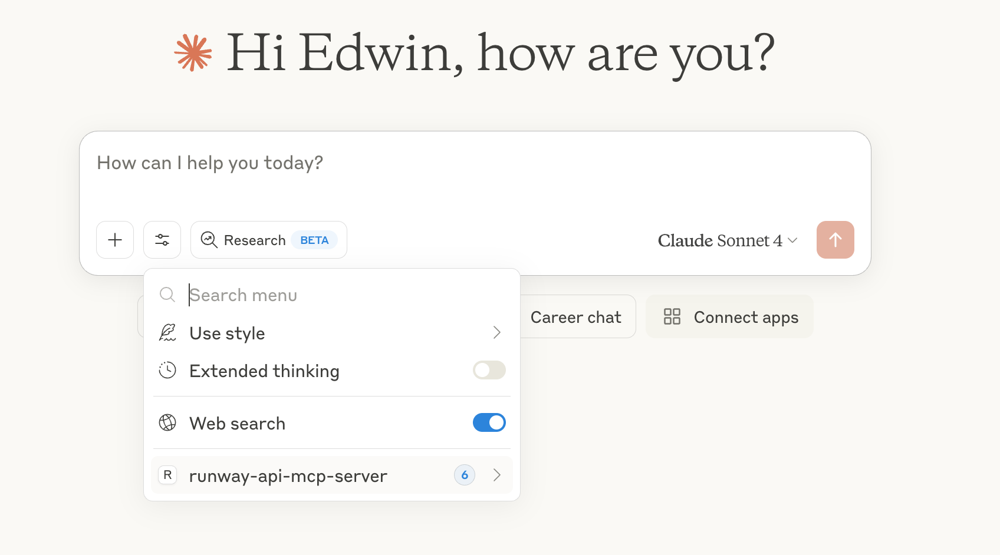

<small>Video sped up for demo purposes</small>

# Runway API MCP Server

This repository holds the code for a MCP server that calls the Runway API.

## Tools

The following tools are available in this MCP:

| Tool Name              | Description                                                 | Parameters                                                                                                                                                            |
| ---------------------- | ----------------------------------------------------------- | --------------------------------------------------------------------------------------------------------------------------------------------------------------------- |
| `runway_generateVideo` | Generates a video from an image and a text prompt           | - promptImage <br/> - promptText (optional) <br/> - ratio <br/> - duration                                                                                            |
| `runway_generateImage` | Generates an image from a text prompt, and reference images | - promptText <br/> - referenceImages (note that uploaded images won't work as references, only previously generated ones, or URLs to images will work.) <br/> - ratio |
| `runway_upscaleVideo`  | Upscale a video to a higher resolution                      | - videoUri                                                                                                                                                            |
| `runway_editVideo`     | Edits a video, optionally provide reference images.         | - videoUri, referenceImages, promptText                                                                                                                               |
| `runway_getTask`       | Gets the details of a task                                  | - taskId                                                                                                                                                              |
| `runway_cancelTask`    | Cancels or deletes a task                                   | - taskId                                                                                                                                                              |
| `runway_getOrg`        | Get organization information                                |
|                        |

## Prerequisites

Before starting, you'll need to have setup your Developer account on the [Runway API](https://dev.runwayml.com/), [setup Billing](https://docs.dev.runwayml.com/guides/setup/), and also created an API Key.

You'll also need [Node.js](https://nodejs.org/) setup.

## Setup

1. Clone this repository and save it to a folder on your computer. Remember where you saved this folder because you'll need it in a later step.

2. Run `npm install` in the folder, then `npm run build`. You should now see a new folder called `build` with a `index.js` file inside.

### Using the MCP with Claude Desktop

3. Follow the [MCP quickstart instructions](https://modelcontextprotocol.io/quickstart/user#2-add-the-filesystem-mcp-server) to setup a config file for Claude. If you already have it, open it by running:

MacOS

```bashrc
open ~/Library/Application\ Support/Claude/claude_desktop_config.json
```

Windows

```powershell
notepad %APPDATA%\Claude\claude_desktop_config.json
```

4. Add the `runway-api-mcp-server` to the config, make sure to replace the file path and Runway API key.

```json
{
  "mcpServers": {
    "runway-api-mcp-server": {
      "command": "node",
      "args": [
        "<ABSOLUTE_PATH_TO_YOUR_CLONED_REPO_FROM_STEP_1>/build/index.js"
      ],
      "env": {
        "RUNWAYML_API_SECRET": "<YOUR_RUNWAY_API_KEY_HERE>",
        "MCP_TOOL_TIMEOUT": "1000000"
      }
    }
  }
}
```

6. Now restart Claude Desktop, and you should see the `runway-api-mcp-server` in Claude's tools:



7. Now, try asking Claude to generate images or videos!

> [!NOTE]  
> Images generated by the Runway API lives only for 24 hours at the generated link. There is no way to recover them after this link expires. Make sure to download the images before they expire.
